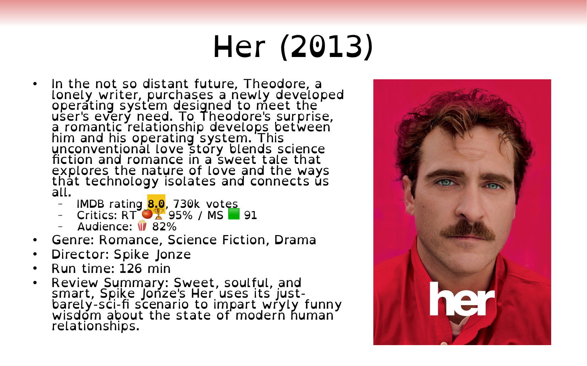

# Movie Slide Maker

Build reference-styled movie introduction slides for teaching from current movie data, with
cross-provider identity checks and semantic presentation validation that protect the intended
layout.

Status: working end to end. The root CLI creates validated one-movie ODP files, and the package batch
entry creates a self-checked review deck plus retained PNG page renders.

<!-- screenshots:begin (managed by screenshot-docs) -->

<!-- screenshots:end -->

## From identity to lecture slide

The project is designed for instructors who introduce films in lecture decks and want current
metadata without manually reconciling several movie sites. One movie identity flows through a
committed teaching template while each provider remains responsible for its own data.

- Accept a title and year, IMDb id or URL, or TMDB id or URL.
- Anchor cross-provider identity on the IMDb id before building output.
- Combine TMDB metadata and poster art with IMDb, Rotten Tomatoes, and Metacritic ratings.
- Highlight the IMDb score, compact large vote counts, and distinguish critics from the optional
  Rotten Tomatoes Popcornmeter.
- Preserve the template's labels, bullet hierarchy, OpenDyslexic typography, and poster region.
- Preserve the lecture deck's exact 28 by 17.5 cm page size and validate the converted ODP by
  semantic role and geometry before deleting scratch files.
- Stop before output when required identity, critics consensus, Metascore, or poster data is absent.

The resulting slide is organized around a centered `Title (Year)` heading, a teaching outline with
plot and rating context, and an aspect-preserving poster. The permanent runtime design authority is
[`template/movie_slide_template.pptx`](template/movie_slide_template.pptx).

## Quick start

The first-success path needs Bash, Python 3.12, the configured TMDB token, OpenDyslexic, and the
LibreOffice and Python dependencies in [docs/INSTALL.md](docs/INSTALL.md). Run the sole root CLI:

```bash
source source_me.sh
./make_movie_slide.py
```

Enter an IMDb URL at the prompt. This exact example resolves Spider-Man 2 across all four providers,
builds the slide, converts it, and validates the final product:

```text
Movie title/year, IMDb id or URL, or TMDB id or URL: https://www.imdb.com/title/tt0316654/
Resolving movie identity with TMDB...
Resolved Spider-Man 2 (2004); fetching ratings...
All provider data validated; building the presentation...
Created validated movie slide: spider_man_2_2004.odp
```

The result is `./spider_man_2_2004.odp`. The scratch PPTX is removed only after semantic ODP
validation succeeds.

## Build the review deck

The permanent batch entry needs no terminal input. It resolves five built-in movies through the
same live provider and presentation path:

```bash
source source_me.sh && python3 -m slide_maker.review_deck < /dev/null
```

The default order is `Her (2013)`, `Cooties (2014)`, `It (2017)`, `Sinners (2025)`, and
`A Ghost Waits (2020)`. The current acceptance run created four validated pages and reported a
contextual Rotten Tomatoes failure for `A Ghost Waits (2020)`; live provider availability can change
that accounting. The products are `output_smoke/review_deck.odp` and retained page PNGs under
`output_smoke/review_deck_pages/`.

## Live data contract

The finished workflow uses current data gathered during each run:

| Source | Required contribution |
| --- | --- |
| TMDB | Title, year, plot, genres, runtime, director, ids, and poster |
| IMDb | Rating and vote count |
| Rotten Tomatoes | Tomatometer, optional Popcornmeter, and critics consensus |
| Metacritic | Metascore and display band |

TMDB access requires a v4 read token. Copy `tmdb_key_sample.yml` to the ignored `tmdb_key.yml` and
replace the placeholder with your token before running live provider or pipeline work. Provider
requests share one polite HTTP policy with browser-like headers, randomized delay, timeout, and a
bounded retry for HTTP 403 or 429.

## Project status and limits

- The repository currently targets macOS, Python 3.12, LibreOffice Still, and OpenDyslexic.
- Live provider markup and values can change. Direct E2E scripts validate identity, required fields,
  and plausible ranges instead of freezing current ratings.
- Movies without a current Rotten Tomatoes critics consensus or Metascore are rejected by design.
- `SLIDE_ARTIFACTS/` is ignored local material for planning and comparison. It is not distributed or
  required at runtime; the extracted template is committed instead.

Generated acceptance evidence includes normal and long-text renders at
`output_smoke/visual_accept/her_2013.png` and
`output_smoke/visual_accept/her_2013_long_text.png`, plus the live review deck and its per-page PNGs.

## Documentation

- [`docs/archive/movie_slide_generator_plan.md`](docs/archive/movie_slide_generator_plan.md)
  - completed product requirements, architecture, milestones, and autonomous acceptance record.
- [`docs/active_plans/audits/movie_source_probe_report.md`](docs/active_plans/audits/movie_source_probe_report.md)
  - live source-resolution and parse-path evidence across representative movies.
- [`docs/INSTALL.md`](docs/INSTALL.md) - Python, LibreOffice, Poppler, font, and token setup.
- [`docs/USAGE.md`](docs/USAGE.md) - single-movie input forms, batch execution, outputs, and failures.
- [`docs/E2E_TESTS.md`](docs/E2E_TESTS.md) - direct integration-test conventions and execution model.
- [`docs/CHANGELOG.md`](docs/CHANGELOG.md) - dated implementation decisions, fixes, and verification
  history.
- [`docs/AUTHORS.md`](docs/AUTHORS.md) - maintainer background and project context.

The archived plan records the completed implementation and autonomous acceptance details.

## License

This software is available under the [MIT License](LICENSE.MIT.md).
